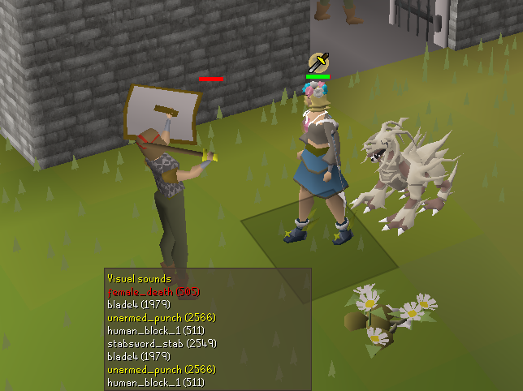
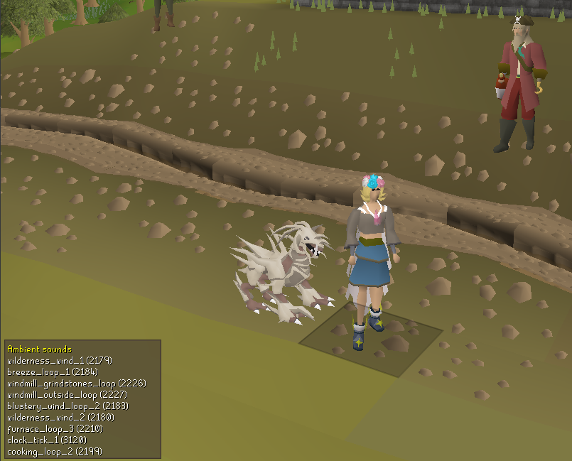
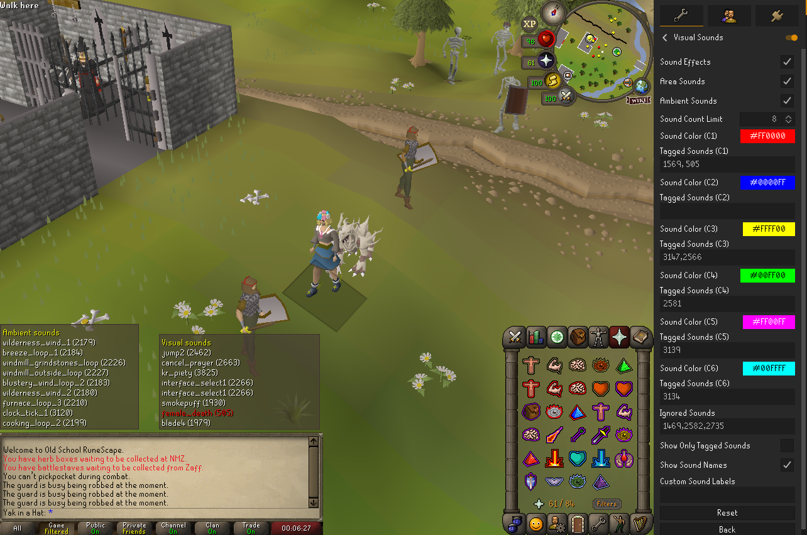

# Visual Sounds

A plugin that allows you to see any sounds that are playing via an overlay.

This is aimed at players who want to be able to "hear" game sounds but are unable to. This could be due to deafness or from something situational, such as not wanting game sounds on at a specific time.

**Please note: Players need to have game sounds on at least partially in order for sound IDs to display. Sounds can be set to as low as 1% in-game but the client can still be muted on an OS level, such as in the Windows volume mixer.**

## Features

-   Show sound effects, area sounds or ambient sounds
-   Show a specified number of sound effect IDs on screen
-   Configurable list of ignored sound effects
-   Configurable list of highlighted sound effects
-   Toggle sound names on or off
-   Pairs great with [Annoyance mute](https://runelite.net/plugin-hub/show/annoyance-mute)

### Showing sound effects

### Showing ambient sounds

### Available config options

